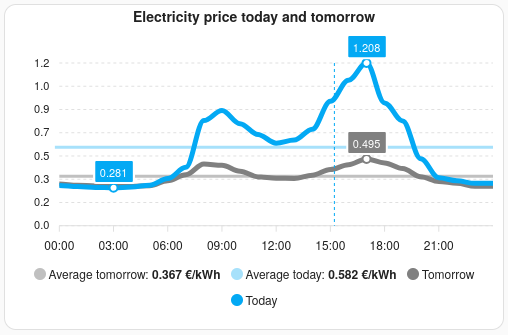

# Home Assistant Enever integration

A non-official Home Assistant integration for [Enever.nl](https://enever.nl/) which provides sensors for the gas and electricity price feed data.

This integration supports all providers supported by Enever, which at the time of writing are:

1. Atoom Alliantie
2. All in power
3. ANWB Energie
4. Budget Energie
5. EasyEnergy
6. Eneco
7. Energie VanOns
8. EnergyZero
9. Frank Energie
10. Groenestroom Lokaal
11. Mijndomein Energie
12. NextEnergy
13. Tibber
14. Vandebron
15. Vrij op naam
16. Wout Energie
17. ZonderGas
18. Zonneplan
19. Beursprijs

All prices (except the Beursprijs) are including taxes and operating costs, ready to use.

There are a few examples of retrieving this data with the built-in RESTful integration. That approach has a few issues however which this integration attempts to solve.

1. Easy setup and no need for complex templates or automations to get up-to-date prices
2. Automatic retries if enever.nl is busy or unreachable, price data remains available and as accurate as possible in the meantime

## Table of contents

- [Provided sensors](#provided-sensors)
  - [Electricity](#electricity)
  - [Gas](#gas)
  - [API request counter](#api-request-counter)
- [Installation](#installation)
  - [HACS](#hacs)
  - [Manual](#manual)
- [Configuration](#configuration)
  - [Adding to Home Assistant](#adding-to-home-assistant)
  - [Creating a chart for upcoming prices](#creating-a-chart-for-upcoming-prices)
- [Developing](#developing)

## Provided sensors

For each supported provider one or two sensors are added for the current electricity price (&euro;/kWh) and/or gas price (&euro;/m&sup3;). These can be used directly as an "entity with current price" in the Energy Dashboard.

These entities are only enabled by default if specified during setup, so you can easily only enable the provider(s) you are interested in. See the Installation section for a screenshot.

### Electricity

The electricity price is fetched from two feeds: today and tomorrow. The entity will update every 15 or 60 minutes with the price for the current time based on these two feeds.

The feeds will only be fetched when required, and after the time the feed is supposed to be refreshed, to minimize API token use. This uses up at least two requests per day, but in case a feed is not yet updated it will try again in an hour. As the data for tomorrow should already be known at that time, unless there is an error for more than 24 hours the electricity price should always be available.

Electricity entities also provide the entire set as attributes, "prices_today" and "prices_tomorrow". These contain a list where each entry has a key "time" containing the date and time, and "price" for the price at that time. These attributes will be set to None if the data is not valid for the current date. This means the "prices_tomorrow" attribute will only be available from around 15:00 - 16:00 to midnight, as it will shift to "prices_today" by then.

In addition the average price is calculated and stored as attributes "today_average" and "tomorrow_average".

The format of the attributes is compatible with the [EV Smart Charging integration](https://github.com/jonasbkarlsson/ev_smart_charging).

### Gas

The gas price is fetched every day at 6:00 when it should be refreshed. The new price is effective immediately.

If the price feed is not updated it will try again in 15 minutes. The entity will keep the value for the previous day for up to 2 hours, as having a slightly incorrect price is still better than no price for calculating total energy cost.

### API request counter

This sensor keeps track of the amount of API requests performed this month by this integration (not including the one required for validating the token during setup). This is useful to see if the integration is behaving nicely, especially if you are not a supporter and have a limited amount of requests available. If this counter is significantly higher than expected, be sure to open an issue.
Note: this may differ from the actual requests remaining, as all attempts are recorded, including where the API is unreachable.

## Installation

### HACS

Go to the HACS dashboard, click on the menu in the top right corner and select 'Custom repositories'. For the Repository field, enter `https://github.com/MvRens/ha-enever`. Select `Integration` as the Type and click 'Add'. A new entry should appear at the top of the dialog and you can now close it. Search for 'Enever' in the store to download and install it.

### Manual

Copy the contents of the `custom_components/enever/` folder in this repository and place it under a `custom_components/enever/` folder in your Home Assistant installation's configuration path. The other files and folders in this repository (such as hacs.json or this README) are not required.

## Configuration

### API token

You will need to request an API token on [enever.nl](https://enever.nl/prijzenfeeds/), follow the instructions there. The integration tries to reduce the number of API calls so the free monthly token limit should not be exceeded. If you are able however, be sure to support them for providing this service!

### Adding to Home Assistant

After installation the integration should be available under Settings - Devices & services. Click the Add integration button and search for "Enever".


### Creating a chart for upcoming prices

Since the electriciy prices are known in advance you can use the attributes to create a chart. Here is an example using the [ApexCharts card](https://github.com/RomRider/apexcharts-card):



```yaml
type: custom:apexcharts-card
update_interval: 10m
graph_span: 1d
span:
  end: day
now:
  show: true
apex_config:
  grid:
    show: true
  legend:
    show: true
  title:
    text: Electricity price today and tomorrow
    align: center
yaxis:
  - show: true
    max: ~0.7
    min: 0
    decimals: 1
    apex_config:
      tickAmount: 7
series:
  - entity: sensor.enever_stroomprijs_nextenergy
    type: line
    name: Average tomorrow
    float_precision: 3
    stroke_width: 3
    data_generator: |
      if (!entity.attributes.prices_tomorrow) return [];
      const value = entity.attributes.tomorrow_average;

      return entity.attributes.prices_tomorrow.map((entry) => {
        const offsetForToday = new Date(entry.time);
        offsetForToday.setDate(offsetForToday.getDate() - 1);

        return [offsetForToday.getTime(), value];
      });
    color: "#c0c0c0"
  - entity: sensor.enever_stroomprijs_nextenergy
    type: line
    name: Average today
    float_precision: 3
    stroke_width: 3
    data_generator: |
      if (!entity.attributes.prices_today) return [];
      const value = entity.attributes.today_average;

      return entity.attributes.prices_today.map((entry) => {
        const offsetForToday = new Date(entry.time);
        offsetForToday.setDate(offsetForToday.getDate() - 1);

        return [offsetForToday.getTime(), value];
      });
    color: "#a7e1fb"
  - entity: sensor.enever_stroomprijs_nextenergy
    type: line
    name: Tomorrow
    float_precision: 3
    show:
      extremas: true
      legend_value: false
    data_generator: |
      if (!entity.attributes.prices_tomorrow) return [];
      return entity.attributes.prices_tomorrow.map((entry) => {
        const offsetForToday = new Date(entry.time);
        offsetForToday.setDate(offsetForToday.getDate() - 1);

        return [offsetForToday.getTime(), parseFloat(entry.price)];
      });
    color: "#808080"
  - entity: sensor.enever_stroomprijs_nextenergy
    type: line
    name: Today
    float_precision: 3
    show:
      extremas: true
      legend_value: false
    data_generator: |
      if (!entity.attributes.prices_today) return [];
      return entity.attributes.prices_today.map((entry) => {
        return [new Date(entry.time).getTime(), parseFloat(entry.price)];
      });
    color: "#03a9f4"
```

## Debug logging

To enable debug logging, add the following configuration to ```configuration.yaml```:

```yaml
logger:
  logs:
    homeassistant.components.enever: debug
```

## Developing

Follow the instructions for [setting up a development environment](https://developers.home-assistant.io/docs/development_environment). I've chosen VS Code + DevContainers. To get better code checking I have not mounted the code as a custom_component, but instead as a native component by adding the following to the devcontainer.json (change the source path accordingly):

```json
"mounts": [
    "source=${localEnv:HOME}/Projects/ha-enever/custom_components/enever,target=${containerWorkspaceFolder}/homeassistant/components/enever,type=bind"
],
```

There is probably a better way, and the downside is that you need to trick HA into accepting the component.

- Modify `script/hassfest/quality_scale.py` and add `"enever"` to the INTEGRATIONS_WITHOUT_QUALITY_SCALE_FILE array.
- Modify `manifest.json` to pass the schema validation. Remove the `"version"` key and add:
  ```json
  "documentation": "https://www.home-assistant.io/integrations/enever",
  ```
- In the DevContainer terminal, run `python3 -m script.hassfest`
