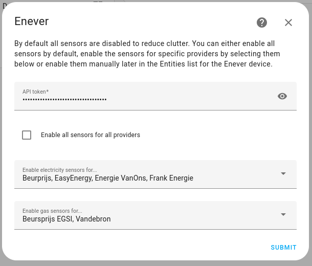

# Home Assistant Enever integratie

Een onofficiële Home Assistant-integratie voor [Enever.nl](https://enever.nl/) die sensoren biedt voor de feeds van gas- en elektriciteitsprijzen.

Deze integratie ondersteunt alle providers die door Enever worden ondersteund. Op het moment van schrijven zijn dit:

1. Atoom Alliantie
2. All in power
3. ANWB Energie
4. Budget Energie
5. EasyEnergy
6. Eneco
7. Energie VanOns
8. EnergyZero
9. Frank Energie
10. Groenestroom Lokaal
11. Mijndomein Energie
12. NextEnergy
13. Tibber
14. Vandebron
15. Vrij op naam
16. Wout Energie
17. ZonderGas
18. Zonneplan
19. Beursprijs

Alle prijzen (met uitzondering van de Beursprijs) zijn inclusief toeslag en belasting en direct te gebruiken.

Er zijn een paar voorbeelden van het opvragen van deze gegevens met de ingebouwde RESTful-integratie. Die aanpak heeft echter een aantal nadelen die deze integratie probeert op te lossen.

1. Eenvoudige installatie en geen complexe sjablonen of automatiseringen nodig om actuele prijzen te verkrijgen.
2. Automatisch opnieuw proberen als enever.nl bezet of onbereikbaar is; de prijsgegevens blijven in de tussentijd beschikbaar en zo nauwkeurig mogelijk.

## Inhoudsopgave

- [Sensoren](#sensoren)
  - [Electriciteit](#electriciteit)
  - [Gas](#gas)
  - [API teller](#api-teller)
- [Installatie](#installatie)
  - [HACS](#hacs)
  - [Handmatig](#handmatig)
- [Configurate](#configuratie)
  - [Toevoegen aan Home Assistant](#toevoegen-aan-home-assistant)
  - [Een grafiek maken voor aankomende prijzen](#een-grafiek-maken-voor-aankomende-prijzen)
- [Debug logging](#debug-logging)
- [Ontwikkelen](#Ontwikkelen)

## Sensoren

Voor elke ondersteunde leverancier worden één of twee sensoren toegevoegd voor de actuele elektriciteitsprijs (€/kWh) en/of gasprijs (€/m³). Deze kunnen direct worden gebruikt als een "entiteit met huidige prijs" in het Energie dashboard.

Deze entiteiten zijn standaard alleen ingeschakeld als ze tijdens de installatie zijn toegevoegd. Het is dus eenvoudig om alleen de provider(s) in te schakelen die relevant zijn. Zie het gedeelte Installatie voor een screenshot.

### Electriciteit

De elektriciteitsprijs wordt opgehaald uit twee feeds: vandaag en morgen. De entiteit wordt elke 15 of 60 minuten bijgewerkt met de prijs voor het huidige tijdstip op basis van deze twee feeds.

De feeds worden alleen opgehaald wanneer nodig en na het tijdstip waarop de feed zou moeten worden vernieuwd, om het gebruik van API-tokens te minimaliseren. Dit kost minimaal twee verzoeken per dag, maar als een feed nog niet is bijgewerkt wordt het na een uur opnieuw geprobeerd. Aangezien de gegevens voor morgen op dat moment al bekend zouden moeten zijn, zou de elektriciteitsprijs, tenzij er een fout optreedt die langer dan 24 uur aanhoudt, altijd beschikbaar moeten zijn.

Elektriciteits entiteiten bieden ook de volledige set aan als attributen, "prices_today" en "prices_tomorrow". Deze bevatten een lijst waarbij elk item een sleutel "time" heeft met de datum en tijd, en een "price" met de prijs op dat moment. Deze attributen worden ingesteld op None als de gegevens niet geldig zijn voor de huidige datum. Dit betekent dat het attribuut "prices_tomorrow" alleen beschikbaar is van ongeveer 15:00 - 16:00 uur tot middernacht, omdat het dan overgaat naar "prices_today".

Daarnaast wordt de gemiddelde prijs berekend en opgeslagen als attributen "today_average" en "tomorrow_average".

Het formaat van de attributen is compatibel met de [EV Smart Charging-integratie](https://github.com/jonasbkarlsson/ev_smart_charging).

### Gas

De gasprijs wordt elke dag om 6:00 uur opgehaald en vervolgens bijgewerkt. De nieuwe prijs is direct van kracht.

Als de prijsfeed niet kan worden bijgewerkt, wordt er na 15 minuten opnieuw een poging gedaan. De entiteit bewaart de waarde van de vorige dag maximaal 2 uur, omdat een iets onjuiste prijs nog steeds beter is dan geen prijs voor het berekenen van de totale energiekosten.

### API teller

Deze sensor houdt het aantal API-aanvragen bij dat deze maand door deze integratie is uitgevoerd (exclusief de aanvraag die nodig is voor het valideren van het token tijdens de installatie). Dit is handig om te controleren of de integratie goed werkt, met name voor de gratis API tokens waarbij het aantal aanvragen beperkt is tot 250 per maand. Als deze teller aanzienlijk hoger is dan verwacht, open dan een issue.

Let op: dit kan afwijken van het werkelijke aantal resterende aanvragen, aangezien alle pogingen worden geregistreerd, ook als de API niet bereikbaar is.

## Installatie

### HACS

Ga naar het HACS-dashboard, klik op het menu in de rechterbovenhoek en selecteer 'Aangepaste repositories'. Voer in het veld Repository `https://github.com/MvRens/ha-enever` in. Selecteer `Integratie` als Type en klik op 'Toevoegen'. Er zou een nieuwe optie bovenaan het dialoogvenster moeten verschijnen en u kunt het nu sluiten. Zoek naar 'Enever' in de store om het te downloaden en te installeren.

### Handmatig

Kopieer de inhoud van de map `custom_components/enever/` uit de ha-enever repository en plaats deze in een map `custom_components/enever/` in het configuratiepad van uw Home Assistant-installatie. De andere bestanden en mappen in deze repository (zoals hacs.json of deze README) zijn niet nodig.

## Configuratie

### API token

Voor deze integratie is een API-token nodig welke aan te vragen is op [enever.nl](https://enever.nl/prijzenfeeds/). Volg hiervoor de instructies. De integratie probeert het aantal API-aanroepen te beperken, zodat de maandelijkse limiet voor gratis tokens niet wordt overschreden. Als u de mogelijkheid hebt, steun Enever dan voor het aanbieden van deze service! Daarmee wordt tevens de limiet verhoogd naar 10.000 aanvragen per maand.

### Toevoegen aan Home Assistant

Na de installatie zou de integratie beschikbaar moeten zijn onder Instellingen - Apparaten en services. Klik op de knop 'Integratie toevoegen' en zoek naar 'Enever'.



### Een grafiek maken voor aankomende prijzen

Aangezien de elektriciteitsprijzen vantevoren bekend zijn, kunt u de attributen gebruiken om een ​​grafiek te maken. Hier is een voorbeeld met de [ApexCharts-kaart](https://github.com/RomRider/apexcharts-card):


```yaml
type: custom:apexcharts-card
update_interval: 10m
graph_span: 1d
span:
  end: day
now:
  show: true
apex_config:
  grid:
    show: true
  legend:
    show: true
  title:
    text: Elektriciteitsprijs vandaag en morgen
    align: center
yaxis:
  - show: true
    max: ~0.7
    min: 0
    decimals: 1
    apex_config:
      tickAmount: 7
series:
  - entity: sensor.enever_stroomprijs_nextenergy
    type: line
    name: Gemiddeld morgen
    float_precision: 3
    stroke_width: 3
    data_generator: |
      if (!entity.attributes.prices_tomorrow) return [];
      const value = entity.attributes.tomorrow_average;

      return entity.attributes.prices_tomorrow.map((entry) => {
        const offsetForToday = new Date(entry.time);
        offsetForToday.setDate(offsetForToday.getDate() - 1);

        return [offsetForToday.getTime(), value];
      });
    color: "#c0c0c0"
  - entity: sensor.enever_stroomprijs_nextenergy
    type: line
    name: Gemiddeld vandaag
    float_precision: 3
    stroke_width: 3
    data_generator: |
      if (!entity.attributes.prices_today) return [];
      const value = entity.attributes.today_average;

      return entity.attributes.prices_today.map((entry) => {
        const offsetForToday = new Date(entry.time);
        offsetForToday.setDate(offsetForToday.getDate() - 1);

        return [offsetForToday.getTime(), value];
      });
    color: "#a7e1fb"
  - entity: sensor.enever_stroomprijs_nextenergy
    type: line
    name: Morgen
    float_precision: 3
    show:
      extremas: true
      legend_value: false
    data_generator: |
      if (!entity.attributes.prices_tomorrow) return [];
      return entity.attributes.prices_tomorrow.map((entry) => {
        const offsetForToday = new Date(entry.time);
        offsetForToday.setDate(offsetForToday.getDate() - 1);

        return [offsetForToday.getTime(), parseFloat(entry.price)];
      });
    color: "#808080"
  - entity: sensor.enever_stroomprijs_nextenergy
    type: line
    name: Vandaag
    float_precision: 3
    show:
      extremas: true
      legend_value: false
    data_generator: |
      if (!entity.attributes.prices_today) return [];
      return entity.attributes.prices_today.map((entry) => {
        return [new Date(entry.time).getTime(), parseFloat(entry.price)];
      });
    color: "#03a9f4"
```

## Debug logging

Om debug-logging in te schakelen, voeg de volgende configuratie toe aan `configuration.yaml`:

```yaml
logger:
  logs:
    homeassistant.components.enever: debug
```

## Ontwikkelen

Volg de instructies voor [het instellen van een ontwikkelomgeving](https://developers.home-assistant.io/docs/development_environment). Ik heb gekozen voor VS Code + DevContainers. Om de code beter te kunnen debuggen, heb ik de code niet als een custom_component gemount, maar als een native component door het volgende toe te voegen aan devcontainer.json (pas het bronpad waar nodig aan):

```json
"mounts": [

"source=${localEnv:HOME}/Projects/ha-enever/custom_components/enever,target=${containerWorkspaceFolder}/homeassistant/components/enever,type=bind"
],
```

Er is waarschijnlijk een betere manier, en het nadeel is dat je Home Assistant moet misleiden om de component te accepteren.

- Wijzig `script/hassfest/quality_scale.py` en voeg `"enever"` toe aan de array INTEGRATIONS_WITHOUT_QUALITY_SCALE_FILE.
- Wijzig `manifest.json` om de schemavalidatie te doorstaan. Verwijder de sleutel "version" en voeg het volgende toe:

  ```json
  "documentation": "https://www.home-assistant.io/integrations/enever",
  ```

- Voer in de DevContainer terminal uit `python3 -m script.hassfest`
